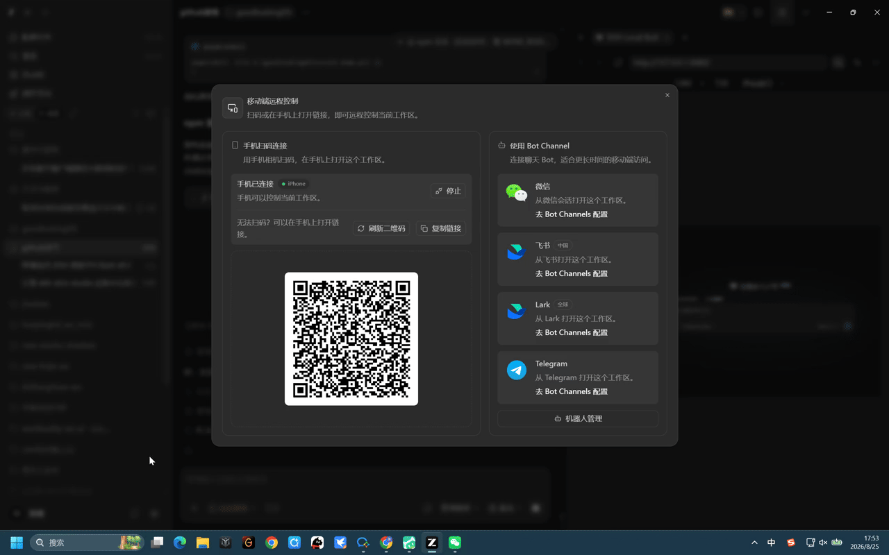

<div align="center">

# 🎨 DSH Skin Studio

**Create, try on, install and share DeepSeek Harness skins — no code required.**

[](./LICENSE)
[](https://github.com/daboge-beach/dsh-skin-studio/actions/workflows/ci.yml)
[](https://nodejs.org/)

**[简体中文](./README.zh-CN.md)** · English

</div>

---



**Why not just a theme pack?** Skins here are *alive*: characters, mascots, cursors and chimes
evolve with the model's reasoning effort — and you can build your own in minutes with the
no-code composer, safely install community packs, and roll anything back.

## ⚡ Quick Start (3 steps)

> Requirements: [Node.js ≥ 20](https://nodejs.org/), pnpm ≥ 9, and [DeepSeek Harness](https://github.com/deepseek-ai/deepseek-harness).

```bash
# 1. Clone and set up (downloads skin assets on first run)
git clone https://github.com/daboge-beach/dsh-skin-studio.git
cd dsh-skin-studio && pnpm setup

# 2. Wire it into your local DSH (idempotent)
pnpm install-to-dsh

# 3. Restart DSH and open it
dsh web   # then: Settings → Skin Studio
```

Interface unreadable after trying a skin? Load `?safe-theme=1` — one click back to native.

> npm distribution is **not published yet** — the install path above (verified in CI)
> is currently the only supported one. See [the roadmap](#-roadmap).

## ✨ What makes it different

| | DSH Skin Studio |
|---|---|
| 🎨 **No-code composer** | Pick colors, drop images, live preview, WCAG contrast check → install or export `.zip`. No `skin.json` handwriting. |
| 🔄 **Living skins** | 18 built-in skins whose background, mascot, cursor and chime shift with the reasoning-effort level (5 tiers). |
| 💾 **Real installs** | Uploaded skins persist in IndexedDB (survive refresh), with update snapshots and one-click rollback. |
| 🛡️ **Safety first** | Zip-bomb/traversal hardening, pre-install capability review, `?safe-theme=1` rescue mode, local-only stats. |
| 🌐 **Bilingual & local-first** | Full Chinese/English UI; everything runs on your machine, nothing uploads. |

## 🚀 More

- [Skin authoring guide](./docs/skin-authoring.md) — ship your own skin in minutes (`pnpm gen:skin`)
- [Verification matrix](./docs/verification-matrix.md) — what's tested, what's verified in real DSH, what needs manual QA
- [Contributing](./docs/CONTRIBUTING.md) · [Security](./SECURITY.md) · [Support](./SUPPORT.md)
- [Changelog](./CHANGELOG.md) — 16 releases, every step test-gated

## 🗺️ Roadmap

- [x] v0.7–v0.16 — welcome dock · upload persistence & safety · composer · safe mode · host adapter · versioning & rollback · local stats
- [ ] npm distribution (blocked: org account) · online skin index · hot-reload dev flow

## ⭐ Show support

If this made your DSH more fun to look at, a star helps others find it — thank you!

## 📄 License

MIT © [daboge-beach](https://github.com/daboge-beach) · Fan-made, not affiliated with Riot Games / Wang Yu / DeepSeek — see the [disclaimer](./README.zh-CN.md#%EF%B8%8F-免责声明--disclaimer).
